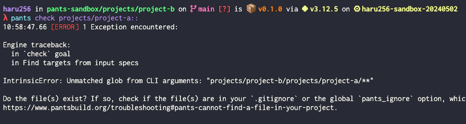

# pants-sandbox

## TODO

- 何故かmypy checkがproject-a or project-bのみしか見てくれない
- pathを指定すると、projects/project-bの下に生えている。正しくは、"projects/project-b/projects/project-a/\*\*"ではなく、  "projects/project-a/\*\*"のようにしたい

## 分かったこと

- uvとの相性がまだ良くない
  - pyproject.tomlのdependency-goupsを見てくれないため、pip compileで別途requirements.txtを作成する必要がある。つまり、2重管理が発生。uv_requirementsでは、サポートしているuvが低いのか、depedency-groupsを見てくれない。以下のPRで対応予定かも？
    - https://github.com/pantsbuild/pants/pull/22161

- pants.tomlの`python.resolves_to_interpreter_constraints`でresolveのinterpreter_constraintsを指定しているが、BUILDで再度interpreter_constraintsを指定する必要があり、2重管理が発生している。

